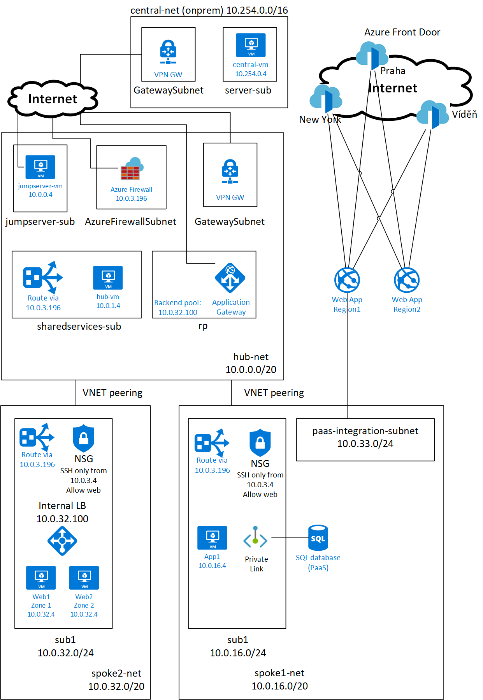

# Introduction to Azure Networking - lab
This repo contains two versions of guide and experiments with networking in Azure.
- CLI-based imperative demo - step by step solution to understand how things are built up
- Infrastructure as Code - complete enterprise-grade environment with single command provisioning to quickly get full setup to test and experiment with and also learn how to automate

# CLI-based demo
This demo is not yet upgraded to newest Azure features, but is great for learning. Also it contains solutions simulating 3rd party components such as routers/firewalls or proxies (simulated using Linux iptables and nginx).

What is included:
* VNETs and subnets
* Hub-and-spoke topology with VNET peering
* Load balancing to different availability zones
* Network Security Groups
* Using jump server to enhance security
* VPN connectivity to on-premises
* Firewall/router to filter traffic between spokes and access Internet (Azure Firewall od 3rd party option)
* IaaS to PaaS integration via Azure Firewall or 3rd party routing/firewall (using Linux router)
* PaaS network integration with Private link
* Deploying reverse proxy (and WAF) in HA to securely expose apps to Internet using Azure Application Gateway or 3rd party solution (NGINX)
* Using ARM templates for automation
* Integrating WebApps (PaaS) with VNET
* Global application delivery with Front Door

Folow instructions in guide.sh and use your name and pod number assigned by instructor.
Instructor will use central.sh to deploy simulation of on-premises environment.

# Infrastructure as Code
What is included:
* VNETs and subnets
* Hub-and-spoke topology with VNET peering
* Load balancing to different availability zones
* Network Security Groups
* Using jump server to enhance security
* VPN connectivity to on-premises
* Azure Firewall Premium with features such as Application rules (FQDN, TLS inspection), IDS, web category filtering or threat protection
* PaaS network integration with Private link
* WAF using Azure Application Gateway
* Integrating WebApps (PaaS) with VNET integration and private link
* Global application delivery with Front Door Premium

Modern, but not yet with all listed features demo is in bicep folder. 

Follow guide in [./bicep/README.md](./bicep/README.md)

Older version is still available in ArmEnv folder.

# Network diagram

