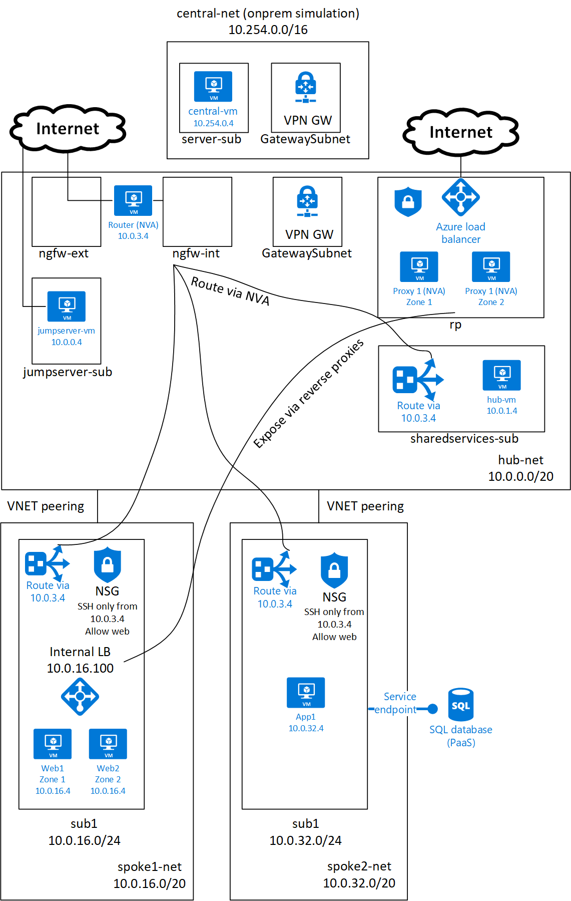

# Introduction to Azure Networking - lab

This lab (guide.sh) will guide you throw creation of enterprise networking environment in Azure including:
* VNETs and subnets
* Hub-and-spoke topology with VNET peering
* Load balancing
* Network Security Groups
* Using jump server to enhance security
* VPN connectivity to on-premises
* Adding 3rd party routing/firewalling device (like NGFW) for traffic between spokes (using Linux router)
* Using 3rd party routing/firewalling for Internet access (using Linux router)
* IaaS to PaaS integration via 3rd party routing/firewall (using Linux router)
* IaaS to PaaS direct integration via Service Endpoints
* Deploying 3rd party reverse proxy (like WAF) in HA to securely expose apps to Internet (using NGINX)
* Using ARM templates for automation

Folow instructions in guide.sh and use your name and pod number assigned by instructor.
Instructor will use centra.sh to deploy simulation of on-premises environment.

# ARM template to quickly build complete demo
This demo using CLI (or GUI) to enforce learning and troubleshooting on the way.

Nevertheless if you need just quickly create complete environment for demonstration or testing purposes, use ARM templates in ArmEnv folder or click Deploy to Azure button here:

# Network diagram

